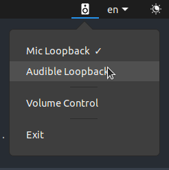

# fleuve

a minimal ui for easier streaming in linux. based on my older gist
["A Somewhat Better Setup for Streaming from Linux."](https://gist.github.com/lostfictions/604e972182dc4fde50f3271341ca5a2f)
unlike the latter, fleuve cleans up all the extra plumbing for you on exit.

not packaged for general distribution yet, but i could do it if there's interest!
